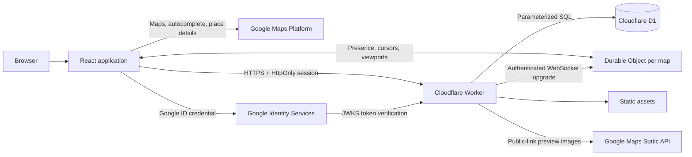

# Pinboard Maps

A small Google My Maps-style application for collecting, annotating, categorising, and privately sharing Google Places. React runs in the browser, one Cloudflare Worker serves both the app and its REST API, and D1 owns all user data and permissions.

## Architecture



Google owns place identity and live place presentation. D1 stores map ownership, memberships, invites, revocable public-link tokens, categories, Place IDs, display names, marker coordinates, and user notes. Saved markers and named lists render from D1; loading a map does not resolve every Place ID again.

## What works

- Google account sign-in with server-side ID token verification
- opaque, random, hashed D1-backed sessions with expiry and logout
- private map creation, editing, and deletion
- normal Google map browsing and native POI click interception
- Google Places autocomplete biased to the current viewport
- one selected-place flow for POIs, search results, and saved markers
- Places UI Kit compact details in a map-side drawer
- saved `AdvancedMarkerElement` stars and named category lists restored from D1
- notes and colour-coded categories
- owner/editor/viewer permissions checked by the Worker
- sharing by verified Google-account email, including pending invites
- live collaborator presence, cursors, and viewport following for shared-map members
- synchronized place and category lists after concurrent edits
- optional revocable public links with anonymous, read-only collaboration access
- D1 migrations and GitHub Actions deployment

## Requirements

- Node.js 24+
- a Cloudflare account with Workers and D1
- a Google Cloud project with billing enabled for Google Maps Platform
- the [Google Cloud CLI](https://cloud.google.com/sdk/docs/install)
- the [GitHub CLI](https://cli.github.com/) if you want the script to configure GitHub Actions

## Automated production setup (recommended)

After cloning the repository, install dependencies and run the production bootstrap:

```bash
npm ci
npm run setup-production
```

The command prompts you to sign in to Google Cloud, Cloudflare, and GitHub, then asks you to select the Google billing project and Cloudflare account. It enables the required Google APIs, creates restricted browser and Worker-only API keys, creates a vector JavaScript map ID, provisions D1, applies migrations, writes the ignored local env files, builds the app, stores Worker secrets, deploys the Worker, and uploads the build-time values to GitHub Actions. It is safe to rerun: resources created by the script are found by their stable names and reused.

There are two required manual Google OAuth interactions because Google does not expose OAuth web-client creation through this setup flow:

1. When prompted, create a **Web application** OAuth client, authorize `http://localhost:8787`, and paste its client ID into the terminal.
2. After Cloudflare reports the final production URL, add that exact origin to the same OAuth client and press Enter.

The initial deployment uses your interactive Wrangler login. GitHub Actions needs a separate, non-interactive Cloudflare API token; Cloudflare deliberately does not let Wrangler export its browser-login credential. The script offers to upload a narrow token with hidden input. If you skip it, validation remains configured but production deployment is disabled until you add `CLOUDFLARE_API_TOKEN` and set the repository variable `CLOUDFLARE_DEPLOY_ENABLED` to `true`.

For a known custom hostname already managed by the selected Cloudflare account, configure its custom-domain route and authorize it during the same run:

```bash
npm run setup-production -- --production-origin=https://maps.example.com
```

Use `--skip-github` if this installation will not use GitHub Actions. Run `npm run setup-production -- --help` for all options. The sections below document the equivalent manual setup and remain useful for troubleshooting.

## Local development

> **Google API prerequisite:** before starting the app, enable **Maps JavaScript API**, **Places API (New)**, **Places UI Kit API**, and **Maps Static API**. Places UI Kit API and Maps Static API are separate activations. The first three belong on the browser key; Maps Static API belongs on the Worker-only preview key.

Install dependencies and create local configuration:

```bash
npm ci
cp .env.example .env
cp .dev.vars.example .dev.vars
```

Fill in `.env` with browser-facing Google values and `.dev.vars` with the OAuth client ID plus the Worker-only Static Maps key. Neither file is committed.

Start the Worker:

```bash
npm run dev
```

`npm run dev` applies any pending local D1 migrations, builds the React app, then watches frontend files while Wrangler runs with live reload, normally at `http://localhost:8787`. Save a frontend file to rebuild and refresh the browser automatically. The local D1 database lives under `.wrangler/`.

Validation commands:

```bash
npm run lint
npm run check
npm test
npm run build
```

The tests run in Cloudflare's Workers Vitest runtime with a real local D1 binding. Google calls are kept outside tests; identity claims are tested at the boundary and API tests seed application sessions directly.

## One-time Google Cloud setup

1. Create or select a Google Cloud project and attach billing.
2. Open **APIs & Services → Library** and separately enable each of the following:
   - **Maps JavaScript API**
   - **Places API (New)**
   - **Places UI Kit API**
   - **Maps Static API**

   **Places UI Kit API and Maps Static API are distinct APIs.** The place popup will not load without the former, and public-link preview images will not load without the latter.
3. Create a JavaScript map ID for Advanced Markers. Use it as `VITE_GOOGLE_MAP_ID`.
4. Create a browser API key for `VITE_GOOGLE_MAPS_API_KEY`.
5. Open the browser key's **API restrictions**, choose **Restrict key**, and allow **Maps JavaScript API**, **Places API (New)**, and **Places UI Kit API**. Under **Website restrictions**, allow `http://localhost:8787/*` plus the production hostname.
6. Create a second API key for `GOOGLE_MAPS_STATIC_API_KEY`. Restrict it to **Maps Static API**. Do not add browser referrer restrictions: the Worker requests preview images server-side and proxies them so this key is never exposed in public-link metadata.
7. Configure the OAuth consent screen with only `openid`, `email`, and `profile` identity scopes. No Gmail, Drive, Contacts, or other Google data scopes are needed.
8. Create a **Web application** OAuth client. Add the production origin and `http://localhost:8787` to Authorized JavaScript origins. This app uses the Google Identity credential callback, so it does not need an OAuth redirect route.
9. Use that client ID for both `VITE_GOOGLE_CLIENT_ID` and the Worker's `GOOGLE_CLIENT_ID` binding.

The browser Maps key and OAuth client ID are public identifiers. Security comes from API/referrer restrictions, OAuth origin restrictions, and server-side token validation—not from trying to hide those values in the bundle.

### Google setup troubleshooting

#### Empty place popup or `GetPlaceWidgetMetadata` returns 403

If the console reports:

```text
Google Maps Places UI Kit Error: The API is not activated on your project
```

confirm that **Places UI Kit API** is enabled in the same Google Cloud project that issued `VITE_GOOGLE_MAPS_API_KEY`. Then confirm that the key's API restrictions include **Places UI Kit API**. Activation or restriction changes can take several minutes to propagate; hard-refresh the browser afterward. Restarting D1 is not required.

#### `[GSI_LOGGER]: The given origin is not allowed`

Open the Web OAuth client used by `VITE_GOOGLE_CLIENT_ID` and add the exact local origin under **Authorized JavaScript origins**:

```text
http://localhost
http://localhost:8787
```

An origin contains the scheme, hostname, and optional port, but no path or wildcard. If you browse using `127.0.0.1`, either switch to `localhost` or authorize that origin separately.

## Places UI Kit experimental boundary

Places UI Kit for Maps JavaScript is experimental and the app deliberately isolates it:

- `PlaceCard.tsx` owns `gmp-place-details-compact`, `gmp-place-details-place-request`, and `gmp-place-standard-content`.
- `PlaceSearch.tsx` owns `PlaceAutocompleteElement` and its `gmp-select` event.
- the Maps loader requests the `beta` channel.

If Google changes these custom elements, those two adapters are the intended update surface. Review Google's current [Place Details Element documentation](https://developers.google.com/maps/documentation/javascript/places-ui-kit/place-details) and [Place Autocomplete documentation](https://developers.google.com/maps/documentation/javascript/place-autocomplete-new) before upgrading the Maps API channel.

## Manual Cloudflare bootstrap

Create the production database:

```bash
npx wrangler d1 create own-maps-prod
```

Replace the existing `database_id` in `wrangler.jsonc` with the returned UUID and commit that change. Then store the Google client ID and Static Maps preview key as Worker secrets/bindings:

```bash
npx wrangler secret put GOOGLE_CLIENT_ID
npx wrangler secret put GOOGLE_MAPS_STATIC_API_KEY
```

The client ID is not intrinsically secret, but storing it as a Worker secret keeps environment-specific server configuration out of the repository. Configure a custom hostname by uncommenting and changing the `routes` entry in `wrangler.jsonc`; no dashboard interaction is required.

Apply the first migration and deploy:

```bash
npm run build
npm run db:migrate:remote
npx wrangler deploy
```

All later schema changes belong in sequential SQL files under `migrations/`. Do not edit production D1 tables manually.

## GitHub Actions production deployment

The workflow in `.github/workflows/deploy.yml` validates pull requests. A push to `main` runs lint, type-checks, tests, builds, applies remote D1 migrations, and deploys the Worker and assets.

Create these GitHub production secrets:

| Secret | Purpose |
| --- | --- |
| `CLOUDFLARE_API_TOKEN` | Narrow token with Workers Scripts edit, D1 edit, and required account read permissions |
| `CLOUDFLARE_ACCOUNT_ID` | Target Cloudflare account |
| `VITE_GOOGLE_MAPS_API_KEY` | Restricted browser Maps key embedded at build time |
| `VITE_GOOGLE_MAP_ID` | Google map ID used by Advanced Markers |
| `VITE_GOOGLE_CLIENT_ID` | Google Identity web client ID embedded at build time |

The persistent Worker `GOOGLE_CLIENT_ID` and `GOOGLE_MAPS_STATIC_API_KEY` secrets are provisioned once with Wrangler. Routine production deployment is then just a push to `main`.

## Security model

- Google credentials are verified against Google's remote JWKS with issuer, audience, algorithm, expiry, and verified-email checks.
- Google `sub`, never email, is the stable external identity key.
- Session cookies are `HttpOnly`, `Secure` in production, `SameSite=Lax`, and scoped to `/`; only a SHA-256 token hash is stored in D1.
- State-changing requests require JSON and a same-origin `Origin` header. Every mutation repeats authorization in the Worker.
- Owner, editor, and viewer capabilities are centralised in `permissions.ts`; the UI's role is only presentational.
- Public links use random UUID tokens, never grant membership, and only reach a read-only GET endpoint. Every mutation still verifies an authenticated owner or editor in the Worker.
- Login throttling is a best-effort per-isolate guard. For globally consistent high-volume limits, add a Cloudflare Rate Limiting binding rather than application state in KV.
- The browser never connects directly to D1. The Static Maps key is only sent from the Worker to Google; clients and social crawlers receive the resulting image, not the key-bearing Google URL.

## API overview

The Worker exposes `/api/auth/google`, `/api/auth/logout`, `/api/me`, map CRUD, nested place/category CRUD, and owner-only invite/member management. `GET /api/maps/:mapId` returns map metadata, the caller's role, categories, and all saved marker coordinates and display names in one response. Authenticated members connect to `/api/maps/:mapId/collaboration`; the Worker rechecks membership before forwarding the WebSocket to the map's Durable Object. Owners can enable a public link through the map's Share dialog; `GET /api/public/maps/:publicToken` serves the same map data with viewer access and no authentication. Anonymous public-link viewers join the same collaboration room under generated guest identities, so they can see presence, share cursors, follow viewports, and receive live data refreshes, but all mutation endpoints still require an authenticated owner or editor. Revoking a public link disconnects its active guest sockets. The public page includes map-specific Open Graph and Twitter metadata whose same-origin image endpoint proxies a 1200×630 Google Static Maps preview, auto-fitted to all saved places with tiny pins. Disabling the link deletes its token, and enabling it again creates a new URL.

## Cost assumptions

This design avoids search-on-pan and avoids Place Details lookups while restoring markers. A map load uses Dynamic Maps; autocomplete and an opened UI Kit detail card use the relevant Google Maps Platform SKUs. Selecting a new place requests `displayName`, which triggers the Places API Place Details Pro SKU, and stores that name so category lists and later map loads need no name lookup. Public-link images use Maps Static API and are cached by Cloudflare's outbound fetch cache and by social clients. Rows created before the display-name migration are backfilled lazily only when selected. Cloudflare static assets are served separately from API and public metadata requests. Allowances and prices change, so confirm current figures on the official [Google Maps Platform pricing](https://mapsplatform.google.com/pricing/) and [Cloudflare Workers pricing](https://developers.cloudflare.com/workers/platform/pricing/) pages before launch. Nothing in product logic hard-codes a price or allowance.

## Deliberate v1 boundaries

There is no offline mode, public map directory or discovery, file upload, contacts integration, notification email, KV, R2, queue, or second backend. Public maps are unlisted and require their exact link. Pending invites become memberships when the invited verified email next signs in.
